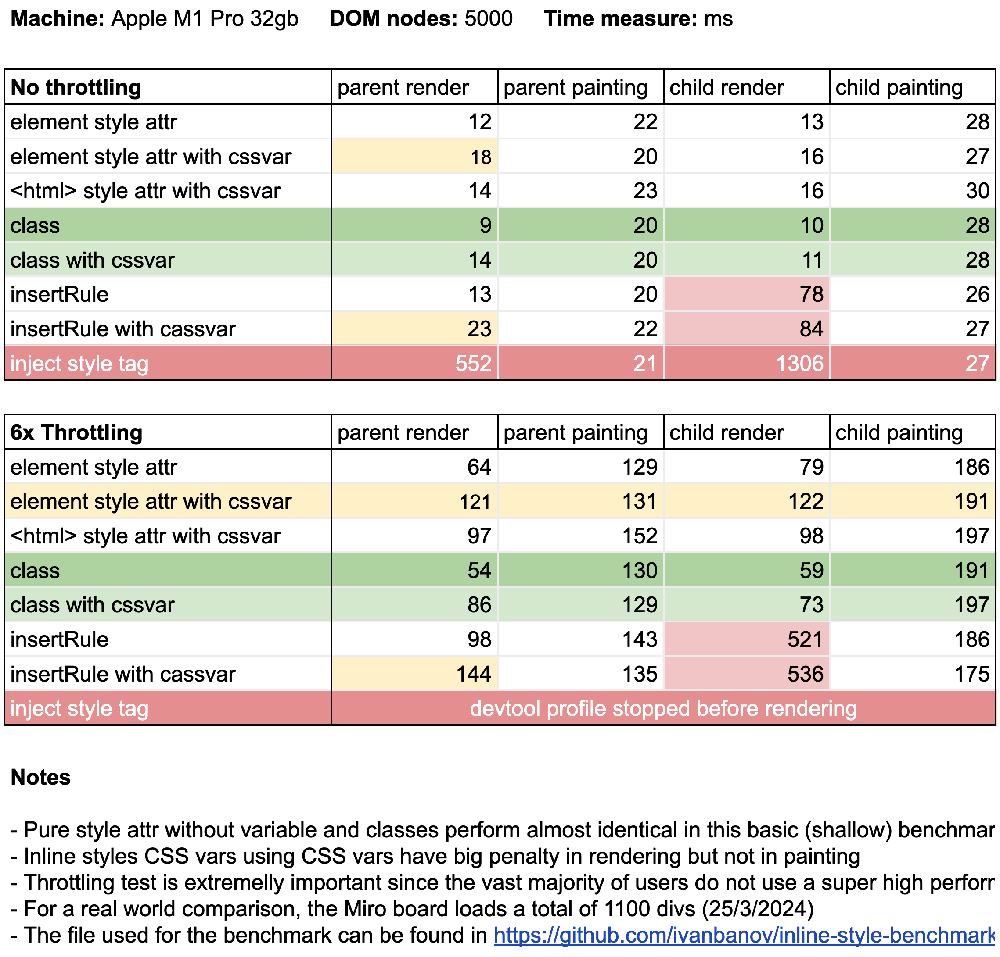
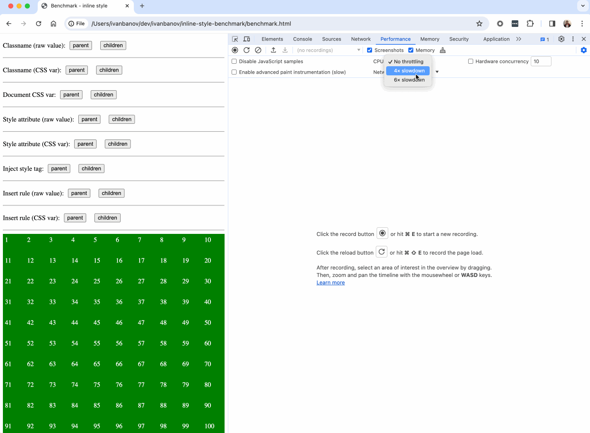

# CSS inline style and classes benchmark

Report available in the [google sheets](https://docs.google.com/spreadsheets/d/1timtjAhMfQ8aOYN14xjsfQreIpzne470-i48L2yin7o/edit#gid=0).

-----

## How is it measured?

