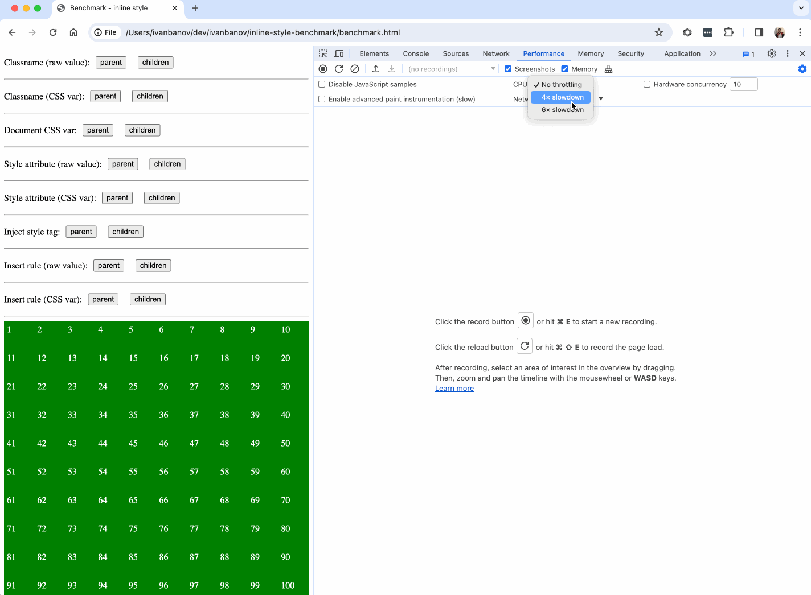

# CSS inline style and classes benchmark

Comparing how expensive it is to change the style of many DOM nodes using different techniques — inline styles, CSS variables, classes, `insertRule`, and injected `<style>` tags.

Repo: https://github.com/ivanbanov/inline-style-benchmark

## Setup

- **Machine:** MacBook Pro · Apple M5 Pro · 64 GB RAM · 18 cores
- **Browser:** Headless Chromium (Playwright)
- **DOM nodes:** 5000 parents, each with 1 child (10,000 nodes)
- **Runs:** 5 per case, median reported
- **Unit:** milliseconds

## Techniques

Each technique is measured twice: changing the **parent** nodes and changing their **child** nodes.

- **element style attr** — sets `el.style.background` (a raw value) on every node.
- **element style attr with cssvar** — sets a CSS variable per node via `el.style.setProperty('--x', …)`.
- **&lt;html&gt; style attr with cssvar** — sets a single CSS variable on `document.documentElement`; every node inherits it.
- **class** — swaps `el.className` to a class that carries a raw value.
- **class with cssvar** — swaps `el.className` to a class that redefines a CSS variable.
- **insertRule** — builds a `CSSStyleSheet`, one `insertRule` per node, attached via `adoptedStyleSheets`.
- **insertRule with cssvar** — same, but each rule sets a CSS variable.
- **inject style tag** — appends 5000 separate `<style>` elements to `<head>`, one rule each.

## Report

Values are medians (ms). 🐇 = fastest in column (**bold**), 🐢 = slowest.

### No throttling

| technique | parent render | parent painting | child render | child painting |
| --- | --- | --- | --- | --- |
| element style attr | **2 🐇** | 7.2 | **2.2 🐇** | 6.7 |
| element style attr with cssvar | 4.4 | **5.6 🐇** | 2.6 | 9.7 🐢 |
| &lt;html&gt; style attr with cssvar | 4.4 | 6.8 | 4.5 | 9.3 |
| class | **2 🐇** | 7.6 🐢 | **2.2 🐇** | 6.6 |
| class with cssvar | 4.3 | 7.1 | 2.5 | 7.7 |
| insertRule | 3.4 | 6.7 | 44.5 | 7.3 |
| insertRule with cssvar | 5.7 | 6.8 | 44.8 | 8.2 |
| inject style tag | 259 🐢 | 6.8 | 514.2 🐢 | **5 🐇** |

### 6× CPU throttling

| technique | parent render | parent painting | child render | child painting |
| --- | --- | --- | --- | --- |
| element style attr | 13.2 | 29.5 | 14.4 | 29.5 |
| element style attr with cssvar | 28 | 31.7 | 15.9 | 28.6 |
| &lt;html&gt; style attr with cssvar | 27.3 | 30.4 | 28.3 | 36.7 🐢 |
| class | **12.3 🐇** | 33.2 🐢 | **14 🐇** | 32 |
| class with cssvar | 27.5 | **26.4 🐇** | 16.4 | 25.9 |
| insertRule | 23 | 29.9 | 282.6 | **23.3 🐇** |
| insertRule with cssvar | 38.1 | 33 | 288.5 | 24.4 |
| inject style tag | 1613.9 🐢 | 28.8 | 3239.2 🐢 | 25.9 |

## How is it measured?



`benchmark.mjs` drives `benchmark.html` with Playwright and reads the same two numbers DevTools shows by hand, straight out of a Chrome DevTools Protocol trace, for every technique × {parent, child} × {1×, 6× CPU throttling}:

- **render** — Recalculate Style (`UpdateLayoutTree`) + Layout
- **painting** — Paint + Composite + Raster

Run it yourself:

```sh
npm install
npx playwright install chromium
npm run benchmark          # RUNS=5 by default; medians written to results.json
```

Absolute milliseconds run lower than the original hand-measured numbers (headless Chromium is faster than GUI Chrome on the same machine), but the relative ordering — the point of the benchmark — reproduces.
